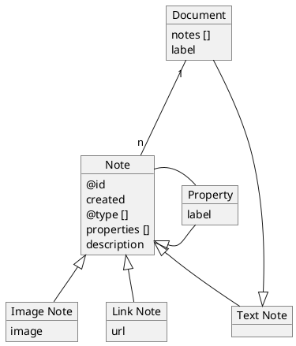

# 2022-06-02

# Motivation
The design and implementation of KnoMa has been motivated by the need for note-taking system.
Although there is plethora of such systems, most focus on text or task management.
The main difference is that KnoMa focus on connecting the knowledge, hence the name KnowMa standing for Knowledge Management.
The motivation can be split into several areas.

## Research and related work
In this case KnoMa is used to store references and links.
The use browser the internet and search for relevant sources for particular topic.
They store the resources, mostly URLs, in the document as notes.
Each note can have a short description and annotations assigned to it.

A document is just a boundary in which the user decide to enter the notes.
It's only meaning is that is provides provenance information about time and actor.

Later on, the user can decide to expand the notes into documents, by creating new documents and linking them to the notes.
This allows to create a hierarchy of documents.

## Video notes
When watching YouTube video, or any other, the application should allow user to take notes, and pictures of the video.
There should be option to add time stamp for the video into the notes detail.

## Image Gallery
User can create collection of images as a first class documents.
An image is a special type of document.
User can provide provenance information and description to each image.

Later user can reference the images from other documents.

## Task Management
User can create a collection of tasks.
A task is a special type of document.
Task can be grouped into projects, provided with deadline or category.
In addition, user can define dependencies between tasks.

## Data Model
The data model is captured by following diagram.


The properties allow us to provide meaning to the notes. 
For example a note, or document, can be marked to be used as a property. 
That is why property is a specialization of a node.

## Type definition
User can define a new type using ```http://www.w3.org/2000/01/rdf-schema#Class```.
A class can be assigned as a type to a note.

## Property definition
User can define a new property using ```http://www.w3.org/2000/01/rdf-schema#Property```.
A property can be used to assign value(s) to a note.

Each property can define domain using ```http://www.w3.org/2000/01/rdf-schema#domain```.
Only codelist can be specified here. 
This allows user to create a custom property whose value is selected from a list.

## Codelist
User can define custom codelist.
To do so user must define ```http://www.w3.org/2004/02/skos/core#ConceptScheme``` document.
This document represent the codelist.

Next user must define values using ```http://www.w3.org/2004/02/skos/core#Concept```.
Values, also called concepts, must be connected to the codelist using ```http://www.w3.org/2004/02/skos/core#inScheme``` property.

## KnoMa ontology
 * https://knoma.skodapetr.eu/vocabulary#url
 * https://knoma.skodapetr.eu/vocabulary#doi
 * https://knoma.skodapetr.eu/vocabulary#author
 * https://knoma.skodapetr.eu/vocabulary#published
 * https://knoma.skodapetr.eu/vocabulary#ref
 * https://knoma.skodapetr.eu/vocabulary#listColor 
   Define color user to visualise this in the resource list.

